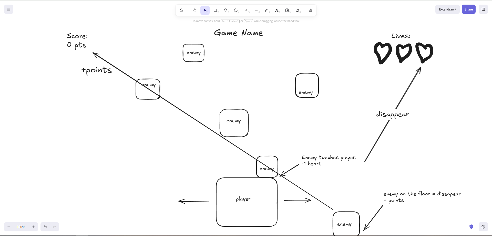

# Dodge Game

A fast-paced arcade dodging game where enemies fall from above and your survival depends on your reflexes.
 
## 🎮 Gameplay
 
Enemies continuously spawn from the top of the screen and move downward toward the player. Your goal is to **avoid getting hit** while letting enemies pass you by to earn points.
 
- Move your character **left** and **right** to dodge incoming enemies
- Enemies that **reach the floor** disappear and award you **points**
- Enemies that **touch the player** cost you a **life**
- Survive as long as possible and aim for a high score

## ❤️ Lives
 
You start with **3 lives** (displayed as hearts in the top-right corner). Every time an enemy collides with the player, you lose one heart. Lose all three and it's **Game Over**.
 
## 🏆 Scoring
 
Your current score is shown in the **top-left corner**. Points are awarded each time an enemy successfully reaches the floor without hitting you — so letting enemies slip past is actually rewarded!
 
## 🕹️ Controls
 
| Key | Action |
|-----|--------|
| ← Left Arrow  or "A"| Move left |
| → Right Arrow or "D"| Move right |
 
## 📋 Rules Summary
 
| Event | Result |
|-------|--------|
| Enemy touches player | -1 heart |
| Enemy reaches the floor | +points, enemy disappears |
| All 3 hearts lost | Game Over |

## 🧩 Entities

### Player
- Green square controlled by the player
- Can move left and right
- Has 3 lives

### Enemy
- Red falling square
- Spawns from the top
- Damages the player on collision

### Score System
- Tracks player points
- Awards points when enemies reach the floor

### UI Elements
- Score display
- Lives display
- Game Over screen

## ⚙️ Tech Decisions

This project uses a functional programming approach.

The game entities are represented as JavaScript objects, while the game logic is handled through separate functions such as movement, collision detection, and score updates.

A functional approach was chosen because the game is relatively small and simple. It makes the code easier to read, debug, and maintain without adding unnecessary complexity through classes.

## 🤖 AI Diary

[Click here to access to AI Diary file.](AI_DIARY.md)

## Trello Board
[Click here to check Trello Board.](https://trello.com/invite/b/6a1421c1431d2eb31b09b382/ATTIb10ecf963e86d85a8590ee0a318c63a4A6E24FBB/game-project)

## 🌐 Live Game

[Click here to access to the game!](https://billerplay.github.io/dodge-game/)

## 🐞 Known Bugs / Future Improvements

No bugs at the moment.
